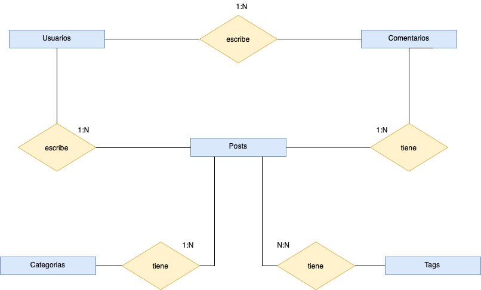
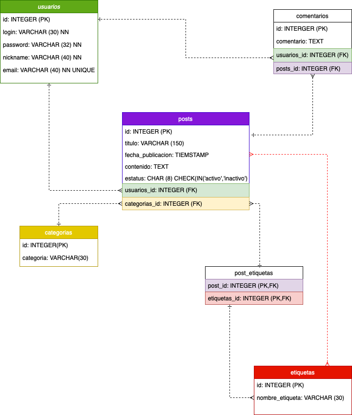

# Diagramas
Para poder comprender las interdependencias acerca de nuestra base de datos, es muy útil ver y analizar estas dependencias en un árbol de dependencias de SQL Server y en última instancia, incluso poder crear un diagrama de dependencias de SQL que muestre visualmente las relaciones jerárquicas.

## Primer Diagrama:

## Segundo Diagrama:
